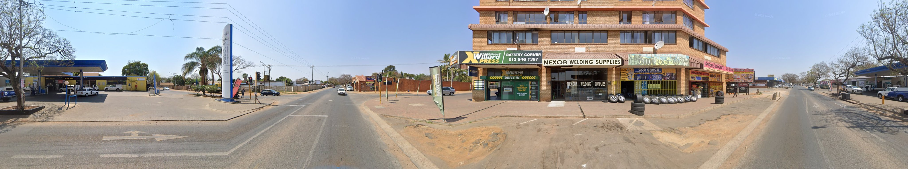
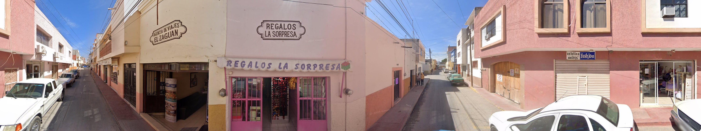
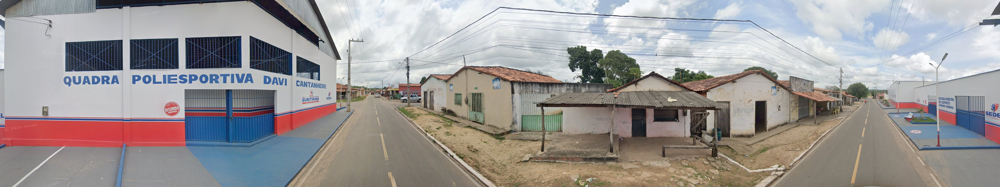
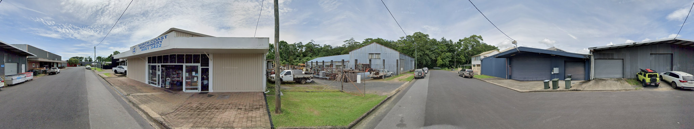
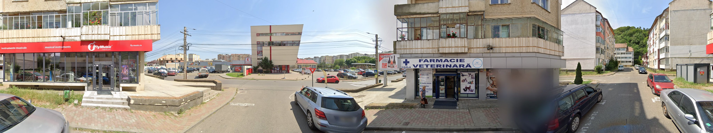

# GeoExp7K-test Successful Examples

This directory contains five geographically diverse examples selected from the
current Gemma4-26B ExpGeoLoc evaluation on the GeoExp7K `test` split. All five
completed successfully with the released experience library and have
prediction-to-ground-truth distance at or below 1 km.

`samples.csv` records the original sample ID, image filename, ground-truth
location, model prediction, and Haversine error in meters. The images are copied
without resizing from the corresponding GeoExp7K-test records.

| Image | Ground truth | ExpGeoLoc prediction | Error |
| --- | --- | --- | ---: |
|  | Pretoria, South Africa | 625 President Steyn St, Pretoria | 0.00 m |
|  | Cerritos, Mexico | Agencia de Viajes El Zaguán, Cerritos | 0.00 m |
|  | Buritirana, Brazil | Quadra Poliesportiva Davi Cantanhede | 0.00 m |
|  | Innisfail, Australia | North Coast Machinery, Innisfail | 0.00 m |
|  | Piatra Neamț, Romania | Fly Music and CozlaVet, Piatra Neamț | 0.01 m |

The full dataset is available from
[Baidu Netdisk (code: `xbxr`)](https://pan.baidu.com/s/17wpiaDFg5ZiermPFtOBp5g?pwd=xbxr).
